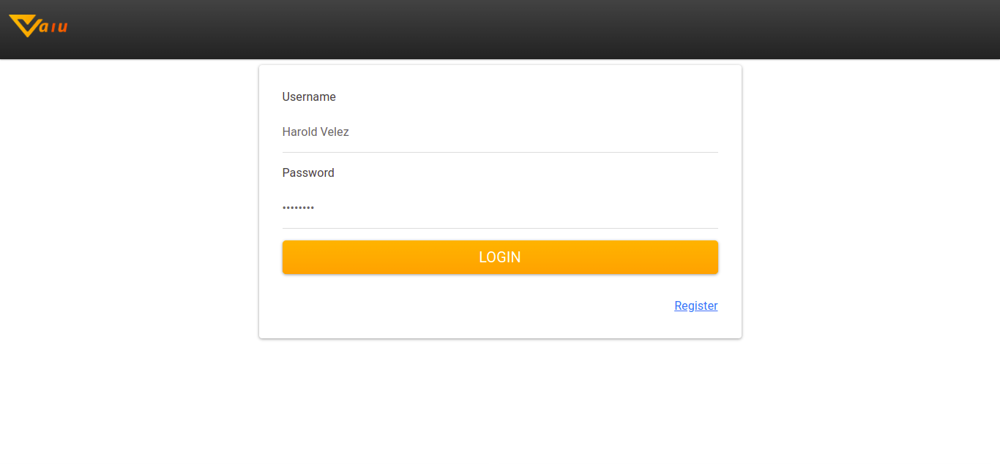

<a href='https://www.meteor.com'></a>


# Vaiu it is an application built with [Meteor](https://www.meteor.com/) , [React](https://es.reactjs.org/) and [Bootstrap](https://www.meteor.com/). With a [Mongo](https://www.mongodb.com/) Database. 

## Quick Start

* Visit the official [install page](https://www.meteor.com/developers/install) to learn more.

* Once meteor is installed, we are going to modify the file environment_example.json and we rename it to environment.json

* For twilio remember to have the variables: TWILIO_ACCOUNT_SID, TWILIO_AUTH_TOKEN, TWILIO_PHONE_NOMBER

* For gmail as email message provider remember the variables: service (Gmail), user (example@gmail.com) and password(super Duper Password)

## Start

```bash
meteor --settings environment.json
```

open [http://localhost:3000/](http://localhost:3000/)

#### Go to Register


#### After registering, you will receive an email or a text message with the corresponding username and password.


#### Now we can create our first transaction


#### And we can list them from the dashboard


